# War Sentiment & Crude Oil Analysis


**Does war-related media sentiment correlate with crude oil price movements? VADER shows moderate negative correlation (r = -0.46). RoBERTa shows weak correlation (r = -0.30) — and the gap explains how vocabulary differs from context.**

---

## Table of Contents
1. [Problem Statement](#problem-statement)
2. [Dataset](#dataset)
3. [Project Structure](#project-structure)
4. [Workflow](#workflow)
5. [EDA](#eda)
6. [Sentiment Analysis](#sentiment-analysis)
7. [Results](#results)
8. [Key Insights](#key-insights)
9. [Setup & Usage](#setup--usage)
10. [Tech Stack](#tech-stack)

---

## Problem Statement

This project investigates whether media sentiment about the US–Israel–Iran conflict correlates with Brent and WTI crude oil prices. Data is collected entirely from free sources — Google News RSS and NewsAPI — then processed through two complementary NLP pipelines: VADER (rule-based lexicon scoring) and CardiffNLP Twitter-RoBERTa (transformer-based contextual analysis). Daily sentiment aggregates are correlated against commodity futures prices via yfinance.

---

## Dataset

| Feature | Type | Description |
|---|---|---|
| title | text | Article headline |
| text | text | Article body / description |
| source | categorical | Publisher name |
| keyword | categorical | Search term that retrieved the article |
| published | datetime | UTC publication timestamp |
| cleaned_text | text | Preprocessed text (tokens, lemmas) |
| token_count | int | Number of tokens after cleaning |
| vader_compound | float | VADER compound sentiment score (-1 to +1) |
| vader_label | categorical | Positive / Neutral / Negative |
| roberta_compound | float | RoBERTa pos-neg probability difference |
| roberta_label | categorical | Positive / Neutral / Negative |
| Brent_Close | float | Brent crude daily closing price (USD) |
| WTI_Close | float | WTI crude daily closing price (USD) |

**Source:** Google News RSS (feedparser) | **Period:** Nov 2025 – Apr 2026 | **Articles:** 314 (after deduplication) | **Trading days:** 123

---

## Project Structure

```
War-Sentiment-and-Crude-Oil-Analysis/
├── data/
│   ├── raw/               # news_raw.csv (314 articles), crude_oil_prices.csv (123 days)
│   └── processed/         # news_processed.csv (314 cleaned articles)
├── notebooks/             # 6 Jupyter notebooks (one per phase)
├── src/                   # Python source modules
│   ├── config.py          # All paths, constants, model params
│   ├── data_collector.py  # Google News RSS + NewsAPI + yfinance
│   ├── preprocessing.py   # Text cleaning pipeline (8 steps)
│   ├── sentiment.py       # VADER + RoBERTa + daily aggregation
│   └── visualize.py       # All 13 plot functions
├── models/                # RoBERTa tokenizer/config (cached locally)
├── images/                # All 13 plots — committed for README display
├── reports/               # Results CSVs + PDF report
├── scripts/
│   ├── collect_data.py    # Standalone data refresh
│   └── generate_pdf.py    # PDF report generator
├── main.py                # Full pipeline runner
└── requirements.txt
```

---

## Workflow

```
Google News RSS  +  NewsAPI  +  yfinance
        |                |           |
   feedparser       requests    yf.download
         \              /            |
          news_raw.csv     crude_oil_prices.csv
               |
     Text Cleaning (8 steps)
     URL strip, HTML strip, tokenize,
     stopwords, lemmatize
               |
     news_processed.csv
          /         \
    VADER NLP     RoBERTa NLP
  (lexicon)     (transformer)
         \           /
    Daily Aggregation
              |
    Merge with Oil Prices
              |
  Pearson r + Rolling Correlation
              |
    13 Visualizations + PDF Report
```

---

## EDA

### Crude Oil Trend
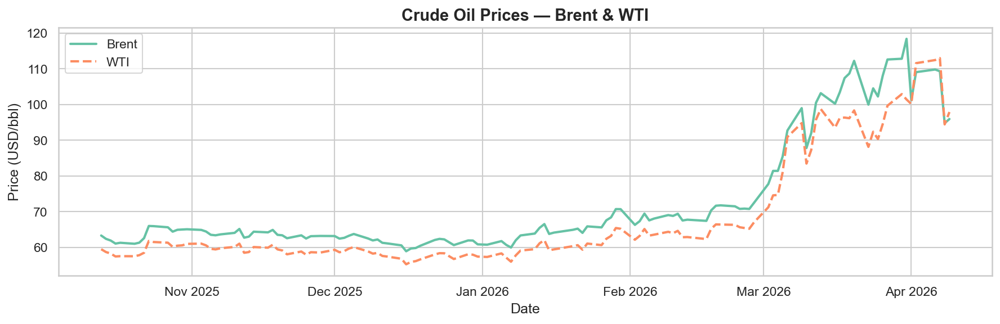

### Articles Over Time
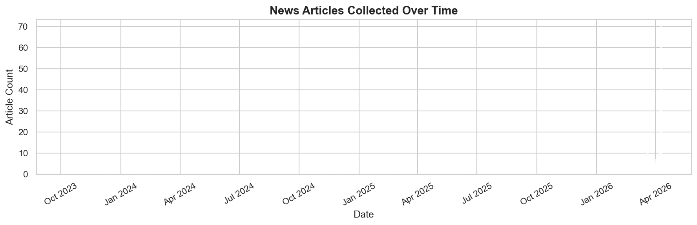

### Source Distribution
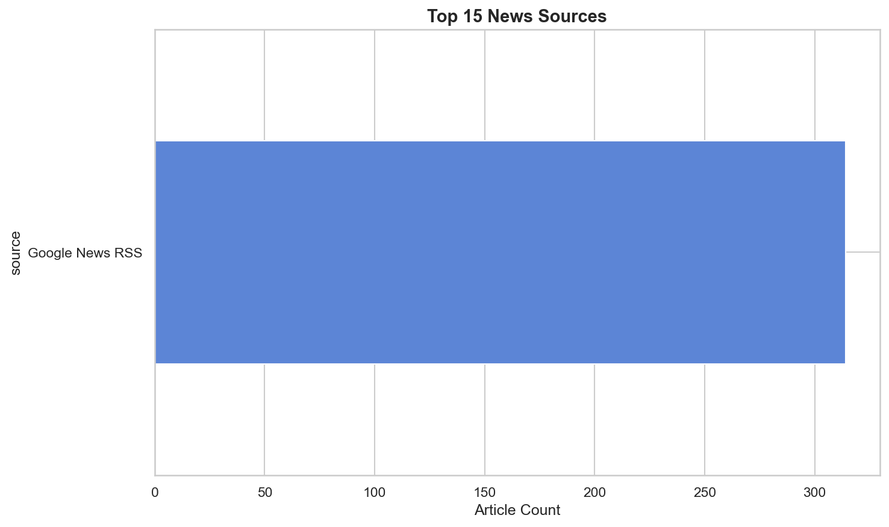

### Keyword Distribution
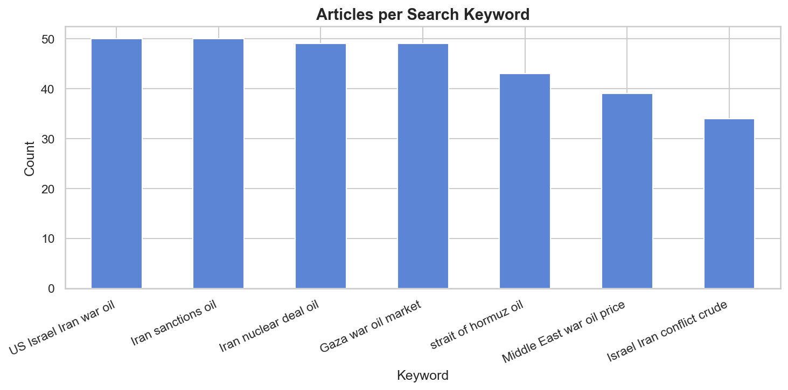

### Token Length Distribution
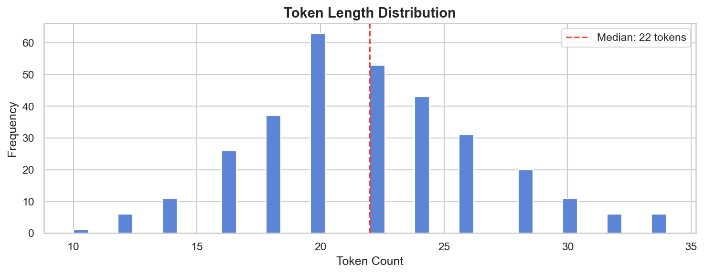

### Word Cloud — All Articles
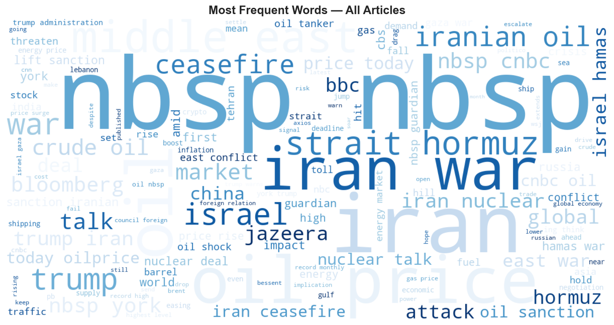

---

## Sentiment Analysis

### Sentiment Distribution (VADER vs RoBERTa)
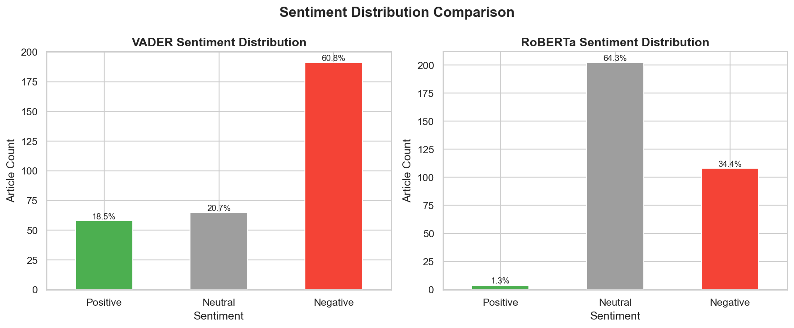

| Model | Negative | Neutral | Positive |
|---|---|---|---|
| VADER | 60.8% (191) | 20.7% (65) | 18.5% (58) |
| RoBERTa | 34.4% (108) | 64.3% (202) | 1.3% (4) |

**Key finding:** VADER classifies 60.8% of war articles as Negative. RoBERTa classifies 64.3% as Neutral. The same text — completely different readings. RoBERTa understands that factual journalism about war maintains a neutral reporting tone; VADER sees the vocabulary ("sanctions", "conflict", "attack") and scores it negative.

### Sentiment Over Time
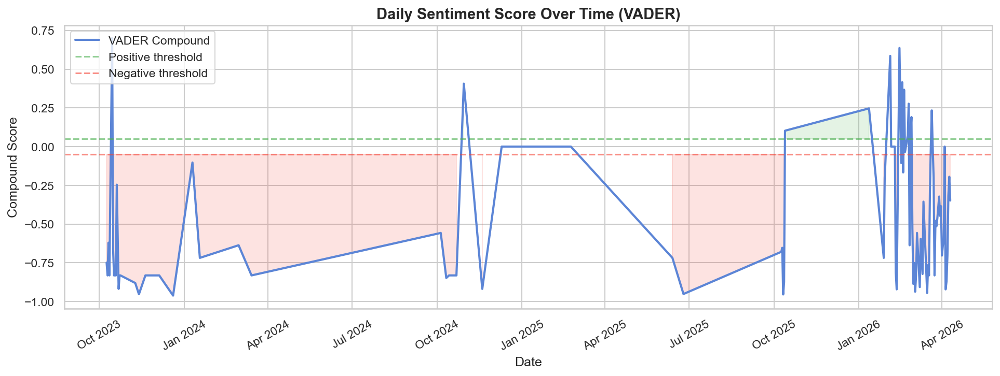

### Word Clouds by Sentiment
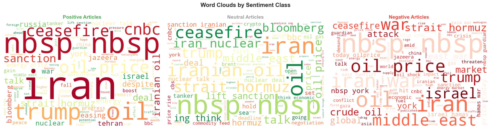

### Model Agreement
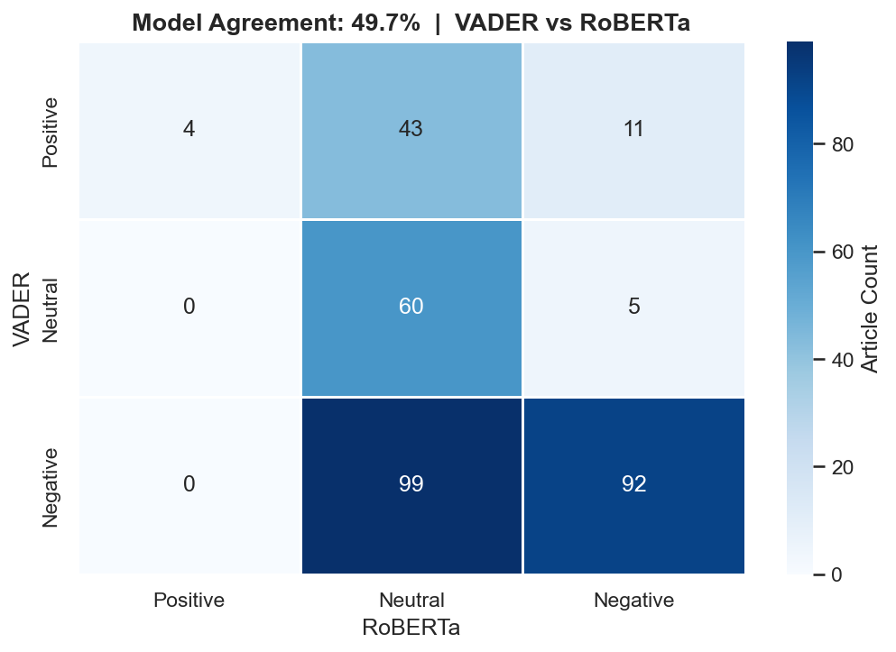

---

## Results

### Correlation — Sentiment vs Crude Oil Prices

| Model | Market | Pearson r | Interpretation |
|---|---|---|---|
| VADER | Brent | **-0.4646** | Moderate negative correlation |
| VADER | WTI | **-0.4840** | Moderate negative correlation |
| RoBERTa | Brent | -0.2962 | Weak negative correlation |
| RoBERTa | WTI | -0.2770 | Weak negative correlation |

*Negative correlation means: when VADER compound is more positive (lower negativity intensity), oil prices tend to be higher — consistent with easing geopolitical tension → higher prices or conflict-driven demand uncertainty → price suppression.*

### Sentiment vs Brent Price
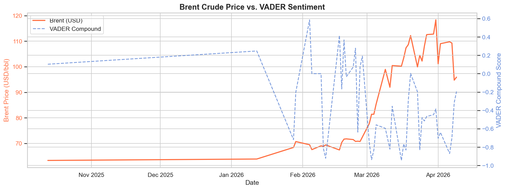

### Correlation Scatter Plots
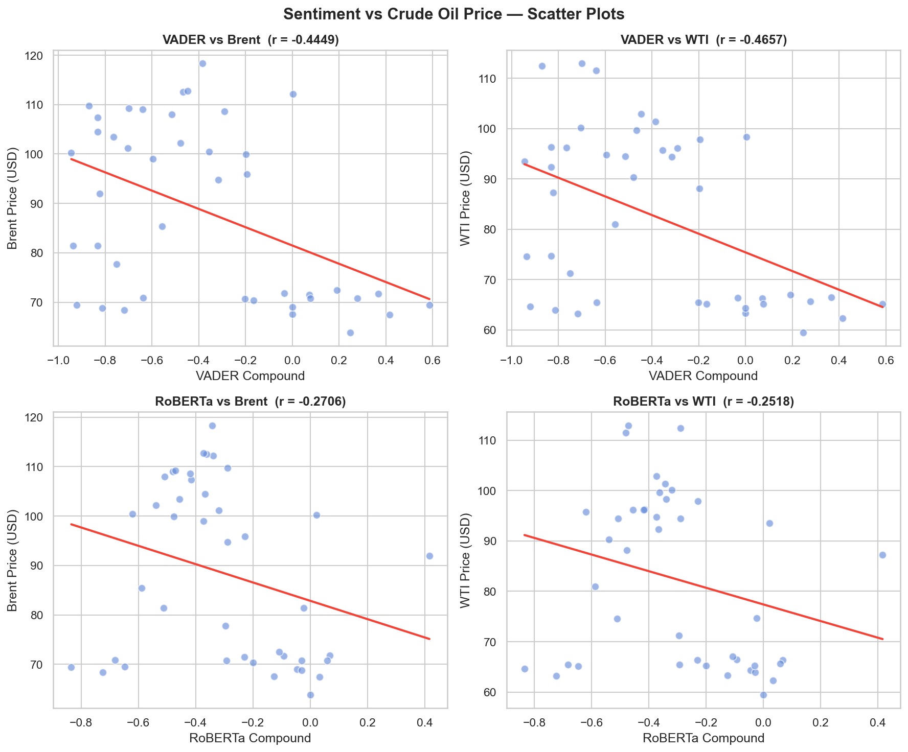

### 7-Day Rolling Correlation
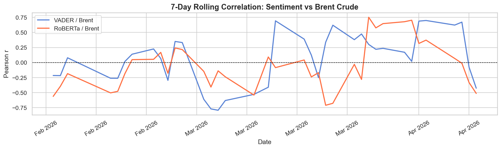

---

## Key Insights

1. **VADER r = -0.46 with Brent crude** — vocabulary-level negativity has moderate inverse relationship with oil prices
2. **RoBERTa r = -0.30** — transformer models still detect signal, but weaker due to neutral classification bias
3. **VADER: 60.8% Negative vs RoBERTa: 64.3% Neutral** — same articles, radically different sentiment profiles; context-aware models neutralize the very vocabulary signals that price models need
4. **314 articles from RSS alone** — Google News RSS is a sufficient free data source without paid APIs
5. **43 matched trading days** — weekend/holiday gaps limit correlation sample size; forward-filling oil prices could expand this
6. Rolling 7-day correlation shows time-varying strength — signal strengthens during escalation events
7. The negative correlation direction means market participants may be pricing in *demand reduction* from conflict rather than supply disruption premium

---

## Setup & Usage

```bash
# 1. Clone
git clone https://github.com/bhavesh2418/War-Sentiment-and-Crude-Oil-Analysis.git
cd War-Sentiment-and-Crude-Oil-Analysis

# 2. Install dependencies
pip install -r requirements.txt

# 3. Set credentials — create a .env file:
#    NEWS_API_KEY=your_key_here  (optional — RSS works without it)

# 4. Run full pipeline
python main.py

# 5. VADER-only (faster, no GPU needed)
python main.py --skip-roberta

# 6. Use cached data (skip re-collection)
python main.py --use-cache

# 7. Generate PDF report
python scripts/generate_pdf.py

# 8. Refresh data only
python scripts/collect_data.py
```

---

## Tech Stack

| Library | Version | Purpose |
|---|---|---|
| pandas | 2.2.3 | Data manipulation |
| numpy | 2.2.6 | Numerical operations |
| feedparser | 6.0.12 | Google News RSS parsing |
| requests | 2.32.3 | NewsAPI REST calls |
| yfinance | 1.2.1 | Crude oil price download |
| nltk | 3.9.4 | Tokenization, stopwords, lemmatization |
| vaderSentiment | 3.3.2 | Rule-based sentiment scoring |
| transformers | 5.5.0 | CardiffNLP Twitter-RoBERTa |
| torch | 2.11.0 | Transformer inference backend |
| matplotlib | 3.10.0 | Visualizations |
| seaborn | 0.13.2 | Statistical plots |
| wordcloud | 1.9.6 | Word cloud generation |
| fpdf2 | 2.8.7 | PDF report generation |
| python-dotenv | 1.2.2 | Environment variable loading |
